# Master Task List

Generated: 2025-09-02T20:31:09+00:00  
Source: [DOCS/todo/todo.json](todo/todo.json)

## Priority 0 (Critical) - 5 items

| ID | Title | Category | Effort | Risk | Files |
|---|---|---|---|---|---|
| [P0-001](#p0-001) | Fix Windows Registry Monitor Import Guards | PLATFORM_GUARD | 30min | Low | [collectors/reg_monitor.py](../collectors/reg_monitor.py) |
| [P0-002](#p0-002) | Fix Windows Service Wrapper Import Guards | PLATFORM_GUARD | 45min | Low | [service/service_wrapper.py](../service/service_wrapper.py) |
| [P0-003](#p0-003) | Fix Response Actions Platform-Specific Code | PLATFORM_GUARD | 25min | Medium | [response/actions.py](../response/actions.py) |
| [P0-004](#p0-004) | Missing Console Web API Import Guard | IMPORT_CYCLE | 20min | Medium | [console/web_api.py](../console/web_api.py), [service/service_wrapper.py](../service/service_wrapper.py) |
| [P0-005](#p0-005) | Event Schema Type Union Resolution | EVENT_SCHEMA | 60min | High | [app_core/schemas.py](../app_core/schemas.py) |

**Total P0 Effort**: 180 minutes (3 hours)

## Priority 1 (High) - 5 items

| ID | Title | Category | Effort | Risk | Files |
|---|---|---|---|---|---|
| [P1-001](#p1-001) | Add Missing Error Handling in Event Bus Worker | EVENT_SCHEMA | 90min | Low | [app_core/bus.py](../app_core/bus.py) |
| [P1-002](#p1-002) | Implement Configuration Hot Reload | CONFIG | 180min | Medium | [app_core/config.py](../app_core/config.py) |
| [P1-003](#p1-003) | Add Comprehensive API Input Validation | API_ROUTER | 120min | Medium | [console/web_api.py](../console/web_api.py), [console/api/operational_mode.py](../console/api/operational_mode.py) |
| [P1-004](#p1-004) | Optimize Event Bus Performance for High Load | EVENT_SCHEMA | 240min | Low | [app_core/bus.py](../app_core/bus.py) |
| [P1-005](#p1-005) | Add Threat Intelligence Database Caching | CONFIG | 150min | Low | [detection/threat_intel_db.py](../detection/threat_intel_db.py) |

**Total P1 Effort**: 780 minutes (13 hours)

## Priority 2 (Medium) - 8 items

| ID | Title | Category | Effort | Risk | Files |
|---|---|---|---|---|---|
| [P2-001](#p2-001) | Add Behavioral Engine Machine Learning Integration | DOCS | 480min | High | [detection/behavioral_engine.py](../detection/behavioral_engine.py) |
| [P2-002](#p2-002) | Implement Advanced File Quarantine System | CONFIG | 360min | High | [response/actions.py](../response/actions.py) |
| [P2-003](#p2-003) | Add Web Console Authentication | API_ROUTER | 300min | Medium | [console/web_api.py](../console/web_api.py) |
| [P2-004](#p2-004) | Implement Real-time Dashboard Updates | API_ROUTER | 240min | Medium | [console/web_api.py](../console/web_api.py) |
| [P2-005](#p2-005) | Add Comprehensive Integration Tests | TEST | 400min | Low | [tests/](../tests/) |
| [P2-006](#p2-006) | Implement Configuration Schema Validation | CONFIG | 180min | Low | [app_core/config.py](../app_core/config.py) |
| [P2-007](#p2-007) | Add Process Tree Analysis | EVENT_SCHEMA | 320min | Medium | [collectors/proc_monitor.py](../collectors/proc_monitor.py), [detection/behavioral_engine.py](../detection/behavioral_engine.py) |
| [P2-008](#p2-008) | Implement Memory-Resident Threat Hunting | DOCS | 600min | High | [detection/](../detection/) |

**Total P2 Effort**: 2880 minutes (48 hours)

---

## Task Details

### P0-001: Fix Windows Registry Monitor Import Guards
**Category**: PLATFORM_GUARD | **Risk**: Low | **Effort**: 30 minutes

**Evidence**: Platform guards implemented but may have typing issues with conditional imports

**Proposed Fix**: Add proper type stubs for winreg when module not available on Linux

**Acceptance Criteria**:
- pyright=0 on collectors/reg_monitor.py
- Registry monitor loads without errors on both Windows and Linux

**Files**: [collectors/reg_monitor.py](../collectors/reg_monitor.py)

---

### P0-002: Fix Windows Service Wrapper Import Guards
**Category**: PLATFORM_GUARD | **Risk**: Low | **Effort**: 45 minutes

**Evidence**: Platform guards for win32 modules may have typing issues with conditional imports

**Proposed Fix**: Add proper type stubs for win32 modules when not available on Linux

**Acceptance Criteria**:
- pyright=0 on service/service_wrapper.py
- Service wrapper loads without errors on Linux
- Service functions return appropriate error messages on Linux

**Files**: [service/service_wrapper.py](../service/service_wrapper.py)

---

### P0-003: Fix Response Actions Platform-Specific Code
**Category**: PLATFORM_GUARD | **Risk**: Medium | **Effort**: 25 minutes

**Evidence**: Platform-aware timeouts and error handling may have typing inconsistencies

**Proposed Fix**: Ensure proper typing for platform-specific timeout and error message logic

**Acceptance Criteria**:
- pyright=0 on response/actions.py
- Process termination works correctly on both platforms
- Appropriate timeouts applied per platform

**Files**: [response/actions.py](../response/actions.py)

---

### P0-004: Missing Console Web API Import Guard
**Category**: IMPORT_CYCLE | **Risk**: Medium | **Effort**: 20 minutes

**Evidence**: service_wrapper imports console.web_api but has try/except guard that may not be typed properly

**Proposed Fix**: Add proper typing and lazy import pattern for optional web API dependency

**Acceptance Criteria**:
- pyright=0 on service/service_wrapper.py
- Service starts correctly when FastAPI not available
- Graceful degradation message logged

**Files**: [console/web_api.py](../console/web_api.py), [service/service_wrapper.py](../service/service_wrapper.py)

---

### P0-005: Event Schema Type Union Resolution
**Category**: EVENT_SCHEMA | **Risk**: High | **Effort**: 60 minutes

**Evidence**: SentinelEvent union type may need explicit type discrimination for proper routing

**Proposed Fix**: Add explicit discriminator field or improve union type handling

**Acceptance Criteria**:
- pyright=0 on app_core/schemas.py
- Event bus routing works correctly for all event types
- No runtime type resolution errors

**Files**: [app_core/schemas.py](../app_core/schemas.py)

---

## Summary Statistics

- **Total Tasks**: 18
- **P0 Critical**: 5 tasks (180 minutes)
- **P1 High**: 5 tasks (780 minutes) 
- **P2 Medium**: 8 tasks (2880 minutes)
- **Total Effort**: 3840 minutes (64 hours)
- **Platform Guard Issues**: 3 tasks (100 minutes)
- **Event System Issues**: 4 tasks (710 minutes)
- **API/Console Issues**: 4 tasks (660 minutes)
- **Configuration Issues**: 3 tasks (690 minutes)

## Dependency Graph

```mermaid
graph TD
    P0001[P0-001: Registry Guards]
    P0002[P0-002: Service Guards] 
    P0003[P0-003: Response Guards]
    P0004[P0-004: Web API Guards]
    P0005[P0-005: Event Schema]
    
    P1002[P1-002: Config Reload]
    P1003[P1-003: API Validation]
    P1004[P1-004: Bus Performance]
    P1005[P1-005: TI Caching]
    
    P2002[P2-002: File Quarantine]
    P2003[P2-003: Web Auth]
    P2004[P2-004: Real-time Updates]
    P2006[P2-006: Config Schema]
    P2007[P2-007: Process Trees]
    P2008[P2-008: Threat Hunting]
    
    %% Dependencies
    P0003 --> P2002
    P1003 --> P2003
    P1001 --> P2004
    P1002 --> P2006
    P1004 --> P2007
    P1001 --> P2008
    P1005 --> P2008
    
    classDef p0 fill:#ff9999
    classDef p1 fill:#ffcc99
    classDef p2 fill:#99ccff
    
    class P0001,P0002,P0003,P0004,P0005 p0
    class P1002,P1003,P1004,P1005 p1
    class P2002,P2003,P2004,P2006,P2007,P2008 p2
```

---

**Document Version**: 1.0  
**Last Updated**: 2025-09-02T20:31:09+00:00  
**Author**: MiniMax Agent