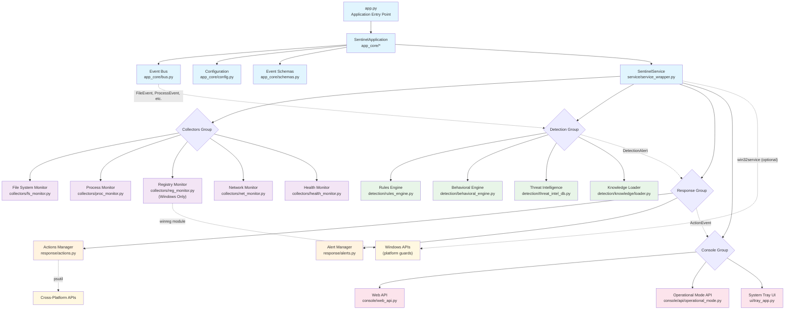
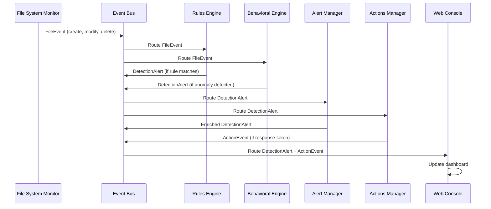
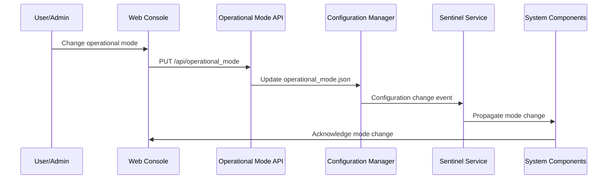

# WatchLockAI Sentinel - System Architecture

## System Overview and Boundaries

WatchLockAI Sentinel is a cross-platform endpoint detection and response (EDR) system built in Python. The system monitors file system, process, registry, and network activities on Windows environments with graceful degradation on Linux for development.

### System Boundaries
- **Target Platform**: Windows 10/11 workstations and servers
- **Development Platform**: Linux (Ubuntu/Debian) with platform guards
- **Runtime Dependencies**: Python 3.8+, async/await support
- **Optional Dependencies**: FastAPI (web console), scikit-learn (ML features)
- **External Integrations**: None (standalone system)

### Core Principles
1. **Event-Driven Architecture**: All components communicate via async event bus
2. **Platform Agnostic Design**: Windows-specific functionality isolated behind guards
3. **Modular Components**: Collectors, detection engines, and response actions are pluggable
4. **Type Safety**: Strong typing with Pydantic schemas and TypedDict patterns
5. **Graceful Degradation**: System operates with reduced functionality when components fail

## Component Map

## Data Flows

### Primary Data Flow: Monitoring -> Detection -> Response

### Configuration and Control Flow

## Dependency Highlights & Pressure Edges

### Top 10 High-Coupling Dependencies

1. **app_core.* -> All Components** (10+ imports)
   - Every component depends on bus, config, and schemas
   - **Pressure**: Changes to core schemas affect entire system
   - **Risk**: Schema changes break multiple components simultaneously

2. **Event Bus -> pydantic** (validation critical path)
   - All event validation flows through Pydantic models
   - **Pressure**: Performance bottleneck for high event volumes
   - **Risk**: Validation errors cascade to all subscribers

3. **collectors.* -> psutil** (system monitoring)
   - File, process, and network monitoring depend heavily on psutil
   - **Pressure**: psutil API changes affect multiple collectors
   - **Risk**: Cross-platform inconsistencies in psutil behavior

4. **console.web_api -> FastAPI** (optional web interface)
   - Web console tightly coupled to FastAPI framework
   - **Pressure**: FastAPI version upgrades require careful testing
   - **Risk**: FastAPI unavailable breaks web console entirely

5. **detection.* -> app_core.schemas** (event type coupling)
   - All detection engines must understand event schema changes
   - **Pressure**: Schema evolution requires detection engine updates
   - **Risk**: Type mismatches cause detection failures

6. **Platform Guards -> Windows APIs** (winreg, win32service)
   - Registry monitoring and service installation Windows-only
   - **Pressure**: Windows API changes affect core functionality
   - **Risk**: Linux development can't test Windows-specific code

7. **service.service_wrapper -> Multiple Subsystems**
   - Service wrapper orchestrates all major components
   - **Pressure**: Changes affect startup/shutdown of entire system
   - **Risk**: Service wrapper failures bring down everything

8. **response.actions -> psutil + platform APIs**
   - Process termination and system actions cross-platform complexity
   - **Pressure**: Platform-specific behaviors require careful handling
   - **Risk**: Incorrect actions could damage target system

9. **detection.knowledge -> File I/O + JSON parsing**
   - Knowledge loading from vendor research and local packs
   - **Pressure**: Large knowledge files impact startup performance
   - **Risk**: Malformed knowledge packs break detection capabilities

10. **All Components -> Logging (loguru)**
    - Universal dependency on structured logging
    - **Pressure**: Log format changes affect monitoring and debugging
    - **Risk**: Logging failures obscure real system issues

### Architectural Debt Areas

- **Event Schema Coupling**: Changes to `SentinelEvent` union type affect many components
- **Configuration Hot Reload**: No mechanism for runtime configuration updates
- **Component Health Monitoring**: Limited health checks between components
- **Error Recovery**: Weak error isolation between major subsystems
- **Performance Monitoring**: No built-in metrics for event processing latency

## Security Architecture

### Trust Boundaries
- **Kernel -> User Space**: System monitors run in user space only
- **Network Boundary**: No external network communication by default
- **Process Boundary**: Components communicate via event bus, not direct calls
- **File System Boundary**: Configuration and logs written to controlled locations

### Threat Model
- **Privilege Escalation**: System runs with limited privileges
- **Code Injection**: Input validation on all event data and API requests
- **Resource Exhaustion**: Event queue limits and memory bounds
- **Configuration Tampering**: Configuration file integrity checks

---

**Document Version**: 1.0  
**Last Updated**: 2025-09-02T20:31:09+00:00  
**Author**: MiniMax Agent