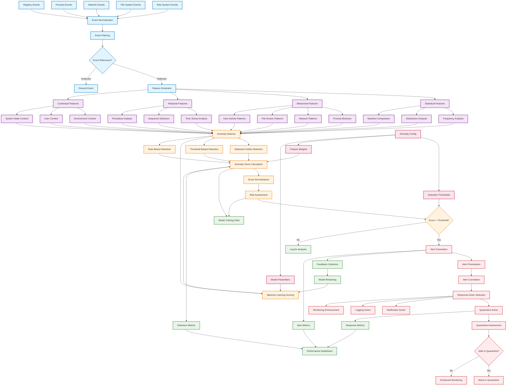

# WatchLockAI Sentinel Anomaly Detection Data Path

This diagram illustrates the anomaly detection pipeline, from raw event data through feature extraction to threat scoring and response actions.

## Feature Extraction Pipeline

### Statistical Features
- **Frequency Analysis**: Event occurrence rates and patterns
- **Distribution Analysis**: Statistical distribution of event parameters
- **Baseline Comparison**: Deviation from established normal behavior

### Behavioral Features
- **Process Behavior**: Process creation patterns, parent-child relationships
- **Network Patterns**: Connection patterns, data transfer anomalies
- **File Access Patterns**: File system access patterns and permissions
- **User Activity Patterns**: User session and activity correlations

### Temporal Features
- **Time Series Analysis**: Trend detection and seasonal patterns
- **Sequence Detection**: Event sequence anomalies and outliers
- **Periodicity Analysis**: Detection of unusual timing patterns

### Contextual Features
- **Environment Context**: System state and configuration context
- **User Context**: User profile and historical behavior context
- **System State Context**: Current system load and resource utilization

## Detection Algorithms

### Statistical Outlier Detection
- **Z-Score Analysis**: Standard deviation-based outlier detection
- **Isolation Forest**: Unsupervised anomaly detection algorithm
- **Local Outlier Factor**: Density-based outlier detection

### Threshold-Based Detection
- **Static Thresholds**: Predefined limits for critical metrics
- **Dynamic Thresholds**: Adaptive limits based on historical data
- **Composite Thresholds**: Multi-dimensional threshold evaluation

### Machine Learning Scoring
- **Supervised Learning**: Trained models for known threat patterns
- **Unsupervised Learning**: Clustering and density estimation
- **Ensemble Methods**: Combined scoring from multiple algorithms

### Rule-Based Detection
- **Pattern Matching**: Signature-based threat detection
- **State Machines**: Complex behavioral pattern detection
- **Expert Rules**: Domain-specific detection rules

## Scoring and Risk Assessment

### Score Calculation
1. **Feature Normalization**: Scale features to comparable ranges
2. **Weight Application**: Apply configured feature importance weights
3. **Algorithm Combination**: Combine scores from multiple detection methods
4. **Score Normalization**: Normalize final score to 0-100 range

### Risk Classification
- **Low Risk (0-30)**: Normal behavior, log for analysis
- **Medium Risk (31-70)**: Suspicious behavior, enhanced monitoring
- **High Risk (71-90)**: Likely threat, generate alert
- **Critical Risk (91-100)**: Immediate threat, automatic response

## Response Actions

### Quarantine Actions
- **File Quarantine**: Move suspicious files to isolated storage
- **Process Termination**: Stop potentially malicious processes
- **Network Isolation**: Block suspicious network connections
- **User Account Lockout**: Temporarily disable compromised accounts

### Notification Actions
- **Real-time Alerts**: Immediate notification to administrators
- **Email Notifications**: Detailed alert information via email
- **System Tray Notifications**: Desktop notifications for local users
- **API Webhooks**: Integration with external alerting systems

### Monitoring Enhancement
- **Increased Sampling**: Higher frequency monitoring of affected areas
- **Additional Metrics**: Expanded data collection for investigation
- **Enhanced Logging**: Detailed logging of related activities
- **Forensic Collection**: Automated evidence collection

## Configuration and Tuning

### Detection Thresholds
- **Global Thresholds**: System-wide anomaly detection sensitivity
- **Per-Category Thresholds**: Specific thresholds for different event types
- **Dynamic Adjustment**: Automatic threshold tuning based on false positive rates

### Feature Configuration
- **Feature Selection**: Enable/disable specific feature categories
- **Weight Assignment**: Relative importance of different features
- **Normalization Parameters**: Feature scaling and transformation settings

### Model Parameters
- **Algorithm Selection**: Choose detection algorithms and ensemble methods
- **Training Parameters**: Model training configuration and hyperparameters
- **Update Frequency**: Model retraining and parameter update schedules

## Performance Monitoring

### Detection Metrics
- **True Positive Rate**: Correctly identified anomalies
- **False Positive Rate**: Incorrectly flagged normal behavior
- **Detection Latency**: Time from event to anomaly detection
- **Throughput**: Events processed per second

### Alert Metrics
- **Alert Volume**: Number of alerts generated per time period
- **Alert Accuracy**: Percentage of actionable alerts
- **Response Time**: Time from alert to response action
- **Resolution Time**: Time to investigate and resolve alerts

### System Performance
- **Resource Utilization**: CPU, memory, and storage usage
- **Processing Latency**: End-to-end processing time
- **Scalability Metrics**: Performance under varying load
- **Availability Metrics**: System uptime and reliability
