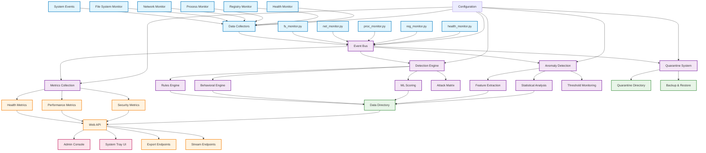

# WatchLockAI Sentinel Data Flow Architecture

This diagram illustrates the primary data flow through the WatchLockAI Sentinel system, from data ingestion through the event bus to metrics output.

## Key Components

### Data Collection Layer
- **fs_monitor.py**: File system monitoring and change detection
- **net_monitor.py**: Network activity and connection monitoring  
- **proc_monitor.py**: Process lifecycle and behavior monitoring
- **reg_monitor.py**: Windows registry change monitoring
- **health_monitor.py**: System health and performance monitoring

### Event Bus (app_core/bus.py)
Central message broker that routes events between components with:
- Asynchronous event processing
- Event filtering and transformation
- Component isolation and fault tolerance
- Metrics collection and monitoring

### Detection Engines
- **Rules Engine**: Pattern-based threat detection
- **Behavioral Engine**: Anomaly detection based on system behavior
- **ML Scoring**: Machine learning-based threat scoring
- **Attack Matrix**: MITRE ATT&CK framework mapping

### Data Storage
- **Data Directory**: Structured storage for events and analysis
- **Quarantine Directory**: Isolated storage for suspicious items
- **Backup & Restore**: Data recovery and historical analysis

### API & UI Layer
- **Web API**: RESTful interface for all system functions
- **Admin Console**: Web-based management interface
- **System Tray UI**: Desktop notification and control
- **Export/Stream**: Data export and real-time streaming

## Data Flow Patterns

1. **Ingestion**: Collectors monitor system activities and generate events
2. **Routing**: Event bus distributes events to appropriate processing engines
3. **Analysis**: Detection engines analyze events for threats and anomalies
4. **Storage**: Processed data stored in structured directories
5. **Response**: Actions taken based on analysis (quarantine, alerts, etc.)
6. **Reporting**: Metrics and status exposed via API endpoints
7. **Interface**: Users interact through web console or tray application

## Configuration Control

The system uses environment variables and configuration files to control:
- Data collection sensitivity and scope
- Detection engine thresholds and rules
- Storage policies and retention
- API security and access control
- UI features and presentation
