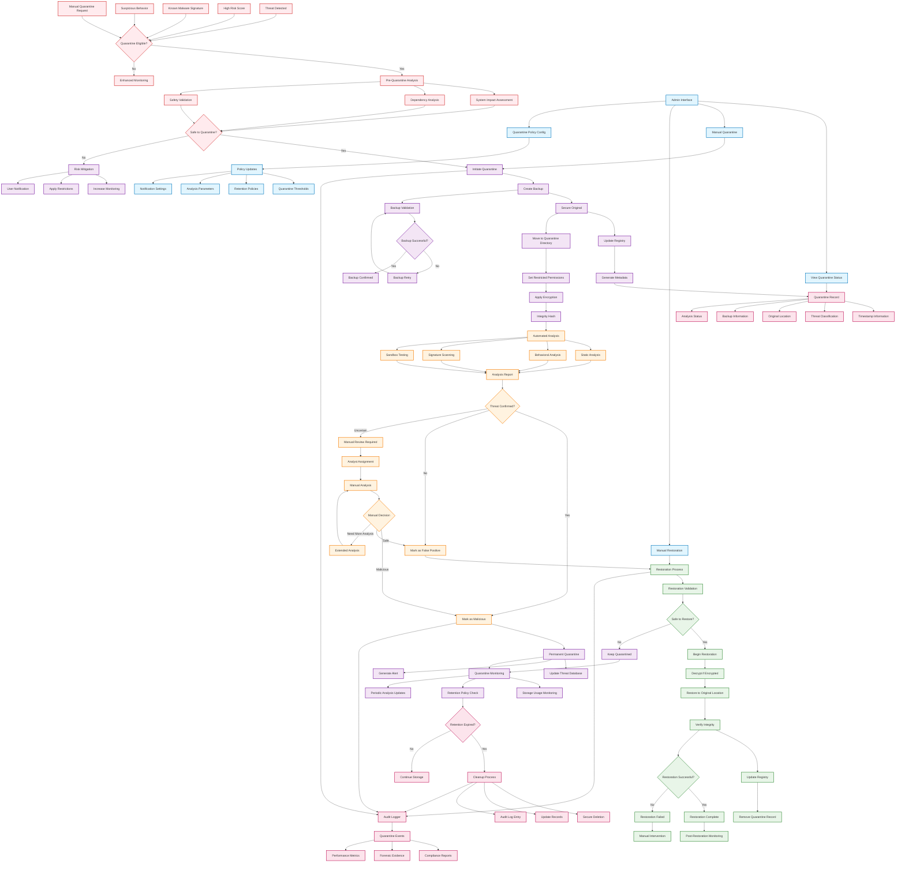

# WatchLockAI Sentinel Quarantine Lifecycle

This diagram illustrates the complete quarantine lifecycle, from threat detection through isolation, analysis, and resolution.

## Quarantine Eligibility Criteria

### Automatic Quarantine Triggers
- **High Risk Score**: Anomaly score above critical threshold (>90)
- **Known Malware Signatures**: Matches in threat intelligence database
- **Suspicious Behavior**: Patterns indicating potential threat activity
- **Policy Violations**: Actions violating established security policies

### Pre-Quarantine Assessment
- **System Impact Analysis**: Evaluate impact of quarantine on system operation
- **Dependency Analysis**: Check for dependencies that might be affected
- **Safety Validation**: Ensure quarantine action won't cause system instability

## Quarantine Process

### Backup Creation
1. **Original State Capture**: Complete snapshot of original file/object
2. **Metadata Preservation**: File attributes, permissions, timestamps
3. **Location Recording**: Original path and directory structure
4. **Integrity Verification**: Cryptographic hash for validation

### Secure Storage
1. **Quarantine Directory**: Isolated storage location with restricted access
2. **Permission Restriction**: Remove execute permissions and user access
3. **Encryption**: Optional encryption for sensitive quarantined items
4. **Integrity Protection**: Regular hash verification for tampering detection

### Registry Management
- **Quarantine Records**: Centralized database of quarantined items
- **Status Tracking**: Current state and analysis progress
- **Metadata Storage**: Complete information about quarantined objects
- **Audit Trail**: Complete history of quarantine actions

## Analysis Pipeline

### Automated Analysis
- **Static Analysis**: File structure and content examination
- **Behavioral Analysis**: Historical behavior pattern analysis
- **Signature Scanning**: Known threat signature detection
- **Sandbox Testing**: Safe execution environment testing

### Manual Review Process
- **Analyst Assignment**: Route uncertain cases to security analysts
- **Investigation Tools**: Provide comprehensive analysis capabilities
- **Decision Documentation**: Record analysis findings and decisions
- **Escalation Procedures**: Handle complex or high-priority cases

## Restoration Process

### Validation Checks
- **Safety Confirmation**: Verify item is safe for restoration
- **System State Check**: Ensure system is ready for restoration
- **Integrity Verification**: Confirm backup integrity before restoration
- **Permission Validation**: Verify restoration permissions

### Restoration Steps
1. **Decryption**: Decrypt quarantined item if encrypted
2. **Location Restore**: Return item to original location
3. **Permission Restore**: Restore original permissions and attributes
4. **Integrity Check**: Verify successful restoration
5. **Registry Update**: Remove quarantine records

### Post-Restoration Monitoring
- **Enhanced Surveillance**: Increased monitoring of restored items
- **Behavioral Tracking**: Monitor for suspicious post-restoration activity
- **Performance Impact**: Track system performance after restoration
- **User Notification**: Inform users of restoration completion

## Administrative Controls

### Quarantine Management
- **Status Dashboard**: Real-time view of quarantine status
- **Manual Actions**: Administrative override capabilities
- **Policy Configuration**: Quarantine threshold and rule management
- **Batch Operations**: Bulk quarantine and restoration operations

### Retention Policies
- **Automatic Cleanup**: Scheduled removal of expired quarantine items
- **Retention Periods**: Configurable retention based on threat type
- **Storage Monitoring**: Track quarantine storage usage and capacity
- **Archive Options**: Long-term storage for forensic evidence

## Security and Compliance

### Access Control
- **Administrative Access**: Restricted access to quarantine functions
- **Audit Logging**: Complete logging of all quarantine activities
- **Encryption Standards**: Strong encryption for sensitive quarantined data
- **Backup Security**: Secure storage and transmission of backups

### Compliance Features
- **Forensic Evidence**: Preservation of evidence for investigations
- **Regulatory Compliance**: Meet data retention and security requirements
- **Audit Reports**: Detailed reports for compliance and review
- **Chain of Custody**: Documented handling of quarantined items

## Performance and Monitoring

### Quarantine Metrics
- **Quarantine Rate**: Number of items quarantined per time period
- **False Positive Rate**: Percentage of incorrectly quarantined items
- **Restoration Success Rate**: Percentage of successful restorations
- **Analysis Completion Time**: Time to complete automated analysis

### System Impact
- **Storage Utilization**: Quarantine storage usage and trends
- **Performance Impact**: System performance during quarantine operations
- **Resource Consumption**: CPU and memory usage for quarantine processes
- **User Impact**: Effect on user workflows and productivity

### Operational Monitoring
- **Queue Depth**: Number of items awaiting analysis
- **Processing Capacity**: Analysis throughput and capacity limits
- **Error Rates**: Frequency and types of quarantine errors
- **Recovery Time**: Time to restore service after quarantine failures
