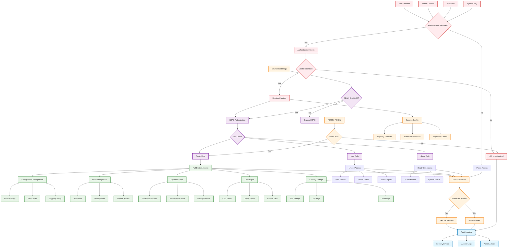

# WatchLockAI Sentinel RBAC & Admin Flow

This diagram illustrates the Role-Based Access Control (RBAC) system and administrative workflows within WatchLockAI Sentinel.

## Authentication Mechanisms

### Session-Based Authentication
- **Cookie Management**: HttpOnly, Secure, SameSite attributes
- **Session Expiration**: Configurable timeout and renewal
- **Token Validation**: HMAC-based session integrity

### API Token Authentication
- **Admin Token**: `ADMIN_TOKEN` environment variable
- **API Keys**: Per-client authentication tokens
- **Token Rotation**: Automated credential refresh

## Role Hierarchy

### Admin Role
**Full system privileges including:**
- Configuration management (feature flags, rate limits, logging)
- User and role management
- System control (start/stop services, maintenance mode)
- Data export and archival operations
- Security settings and TLS configuration

### User Role
**Limited operational access:**
- View system metrics and health status
- Generate basic reports
- Monitor system performance
- Access non-sensitive endpoints

### Guest Role
**Read-only public access:**
- Public metrics and system status
- Basic health information
- No configuration or control capabilities

## Security Controls

### Environment Flag Gating
- **RBAC_ENABLED**: Master switch for role-based access control
- **ADMIN_REQUIRE_AUTH**: Enforce authentication for admin endpoints
- **SESSION_REQUIRE_TLS**: Mandate TLS for session cookies

### Request Validation
1. **Authentication Check**: Verify session or token validity
2. **Role Authorization**: Confirm user has required role
3. **Action Validation**: Ensure specific operation is permitted
4. **Resource Access**: Validate access to requested resources

### Session Security
- **Secure Cookies**: Prevent client-side access and tampering
- **Cross-Site Protection**: SameSite attribute prevents CSRF
- **Session Fixation**: New session ID on authentication
- **Concurrent Sessions**: Optional session limit per user

## Admin Workflow Examples

### Configuration Change
1. Admin authenticates with valid credentials
2. RBAC confirms admin role assignment
3. Configuration endpoint validates permissions
4. Change applied with audit logging
5. System components notified of updates

### User Management
1. Admin accesses user management interface
2. Role verification confirms admin privileges
3. User creation/modification with validation
4. Role assignment with permission mapping
5. Audit trail records administrative action

### Data Export
1. Export request with admin authentication
2. EXPORT_ENABLED flag verification
3. Data access authorization check
4. Export generation with integrity hashing
5. Secure download with audit logging

## Audit and Compliance

### Security Event Logging
- Authentication attempts (success/failure)
- Authorization decisions and role checks
- Administrative actions and configuration changes
- Data access and export operations

### Access Control Monitoring
- Failed authentication attempts
- Privilege escalation attempts
- Unauthorized access attempts
- Session anomalies and security violations

### Compliance Features
- Complete audit trail for all administrative actions
- Role-based segregation of duties
- Configurable session and authentication policies
- Security event correlation and alerting
