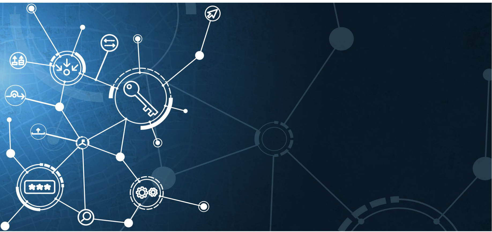
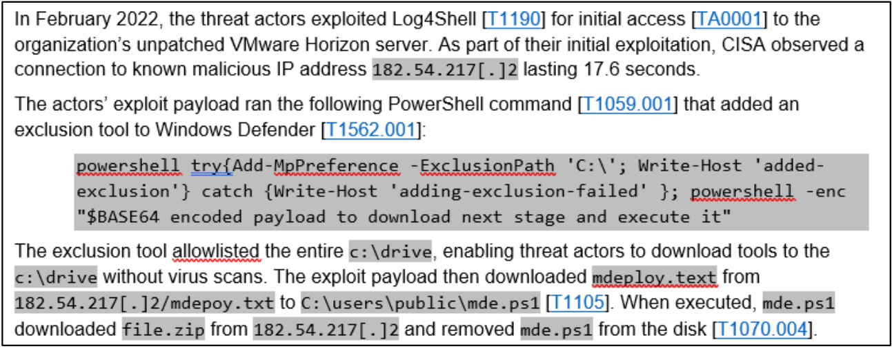
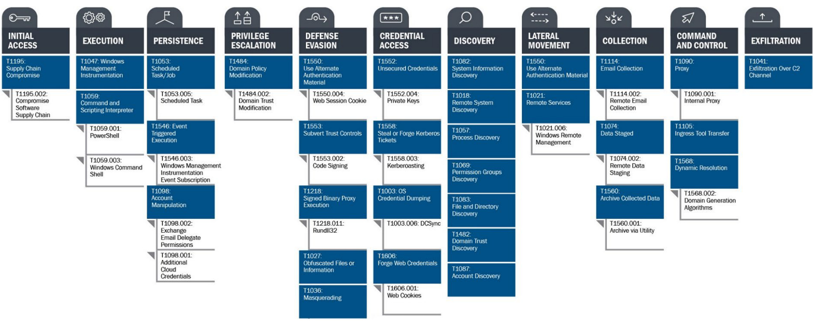
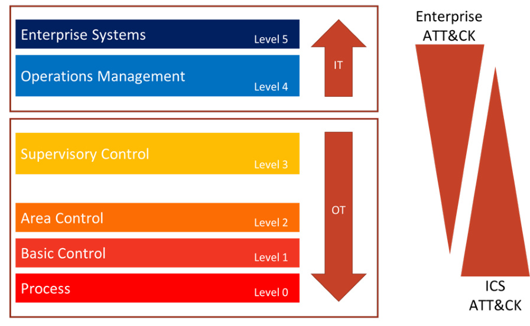

# MITRE ATT&CK  

  

# Best Practices for MITRE ATT&CK ® Mapping  

Publication: January 2023  

# CHANGE RECORD  

<html><body><table><tr><td>Version</td><td>Date</td><td>Revision/Change Description</td><td>Section/Page Affected</td></tr><tr><td>1.0</td><td>June2021</td><td>Initial version</td><td></td></tr><tr><td>2.0</td><td>January2023</td><td>See "What's New" on p. 3.</td><td>Updates throughout and Appendix B replaced</td></tr></table></body></html>  

# INTRODUCTION  

For the Cybersecurity and Infrastructure Security Agency (CISA), understanding adversary behavior is often the first step in protecting networks and data. The success network defenders have in detecting and mitigating cyberattacks depends on this understanding. The MITRE ATT&CK® framework is a globally accessible knowledge base of adversary tactics and techniques based on real-world observations. ATT&CK provides details on ${}100+$ threat actor groups, including the techniques and software they are known to use.1 ATT&CK can be used to identify defensive gaps, assess security tool capabilities, organize detections, hunt for threats, engage in red team activities, or validate mitigation controls. CISA uses ATT&CK as a lens through which to identify and analyze adversary behavior. CISA created this guide with the Homeland Security Systems Engineering and Development Institute™ (HSSEDI), a DHS-owned, federally funded research and development center (FFRDC) that works with the MITRE ATT&CK team.  

# What's New  

Since the initial release of Best Practices for MITRE ATT&CK $\textsuperscript{\textregistered}$ Mapping in June 2021, malicious cyber operators and operations have continued to evolve at a rapid pace. To maintain relevancy and maximize impact for defenders, MITRE ATT&CK has also evolved the ATT&CK framework, adding major new structures, features, and techniques. Beginning with ATT&CK version nine (v9) these changes include:  

* The introduction of new platforms,   
* Expansion of macOS and Linux coverage,   
* Increased equity between the Industrial Control Systems (ICS), Mobile, and Enterprise matrices,   
* The redefinition of data sources and detections, and The addition of ATT&CK Campaigns.  

As of version 12 (v12), ATT&CK for Enterprise contains 14 tactics, 193 techniques, and 401 subtechniques.  

The January 2023 update of Best Practices for MITRE ATT&CK® Mapping covers the above list of ATT&CK updates. This version of the best practices also covers common analytical biases, mapping mistakes, and specific ATT&CK mapping guidance for ICS.  

# ATT&CK Levels  

ATT&CK describes behaviors across the adversary lifecycle, commonly known as tactics, techniques, and procedures (TTPs). In ATT&CK, these behaviors correspond to four increasingly granular levels:  

1.  Tactics represent the "why" of an ATT&CK technique or sub-technique. They are the adversary's technical goals, the reason for performing an action, and what they are trying to achieve. For example, an adversary may want to achieve credential access to gain access to a target network. Each tactic contains an array of techniques that network defenders have observed being used in the wild by threat actors. Note: The ATT&CK framework is not intended to be interpreted as linear--with the adversary moving through the tactics in a straight line (i.e., left to right) to accomplish their goal.2 Additionally, an adversary does not need to use all the ATT&CK tactics to achieve their operational goals.  

2.  Techniques represent "how" an adversary achieves a tactical goal by performing an action. For example, an adversary may dump credentials to achieve credential access. Techniques may also represent what an adversary gains by performing an action. A technique is a specific behavior to achieve a goal and is often a single step in a string of activities intended to complete the adversary's overall mission. Note: Some of the techniques within ATT&CK enable an adversary to achieve multiple tactical goals and thus apply to multiple ATT&CK tactics. Many techniques also include legitimate system functions that can be used for malicious purposes (referred to as "living off the land").  

3.  Sub-techniques provide more granular descriptions of techniques. For example, there are behaviors under the OS credential dumping [T1003] technique that describe specific methods to perform the technique, such as accessing Local Security Authority Subsystem Service (LSASS) memory [T1003.001], Security Account Manager [T1003.002], or /etc/passwd and /etc/shadow [T1003.008]. Sub-techniques are often, but not always, operating system- or platform-specific. Not all techniques have sub-techniques.  

4.  Procedures represent "what" an adversary did and are instances of how an adversary has used a technique or sub-technique. For example, there are many different procedures of OS credential dumping: LSASS memory [T1003.001] based on using different tools, utilities, and commands. Knowing procedures may be useful for replication of an incident with adversary emulation and for detecting malicious activity.  

# ATT&CK Technology Domains  

ATT&CK is organized in three "technology domains"--the ecosystem within which an adversary operates. The ATT&CK domains have matrices that reflect associated platforms (or systems) within each technology domain:  

# MITRE ATT&CK - Enterprise:3  

o Operating systems: Windows, Linux, and MacOS   
o Cloud: Azure AD, Office 365, Google Workspace, Software-as-a-Service (SaaS), Infrastructure-as-a-Service (IaaS)   
o Network: Network infrastructure devices   
o Containers: Container technologies   
o PRE: Covering preparatory techniques, deprecating the previous PRE-ATT&CK domain  

*  MITRE ATT&CK - Mobile: Provides a model of adversarial tactics and techniques to operate within the Android and iOS platforms. ATT&CK for Mobile also contains a separate matrix of network-based effects, which are techniques that an adversary can employ without access to the mobile device itself. MITRE ATT&CK - Industrial Control Systems (ICS): Focuses on tactics and techniques of adversaries whose primary goal is disrupting an industrial control process, including supervisory control and data acquisition (SCADA) systems, and other control system configurations.  

# ATT&CK Mapping Guidance  

CISA is providing this guidance to help analysts accurately and consistently map adversary behaviors to the relevant ATT&CK techniques as part of cyber threat intelligence (CTI)--whether the analyst wishes to incorporate ATT&CK into a cybersecurity publication or an analysis of raw data.  

Successful applications of ATT&CK should produce an accurate and consistent set of mappings, which will not directly solve security challenges but can be used to enable other operations such as:  

Developing adversary profiles. * Conducting activity trend analysis. Augmenting reports for detection, response, and mitigation purposes.  

Although there are different ways to approach this task,  

# To Map or Not to Map  

Why sufficient context matters  

Without adequate contextual technical details to sufficiently describe and add insight into an adversary behavior, there is little value to ATT&CK mapping. For example, a simple list of ATT&CK tactics or techniques--without associated technical context that explains how the adversary executed the techniques--may not be actionable enough to enable network defenders to detect, mitigate, or respond to the threat.  

this guidance provides a starting point. Note: CISA and MITRE ATT&CK recommend that analysts first become comfortable with mapping finished reports to ATT&CK, as there are often more clues within finished reports that can aid an analyst in determining the appropriate mapping.  

For additional resources on learning about and using the ATT&CK framework, see Appendix A. For guidance on mapping ATT&CK to ICS, see Appendix B.  

# MAPPING MITRE ATT&CK INTO FINISHED REPORTS  

The steps below describe a recommended approach to successfully mapping CTI reports to ATT&CK. Analysts may choose their own starting point (e.g., identification of tactics versus techniques) based on the information available and their knowledge of ATT&CK.  

1.  Find the behavior. Searching for signs of adversary behavior is a paradigm shift from looking for indicators of compromise (IOCs), hashes of malware files, URLs, domain names, and other artifacts of previous compromise. Look for signs of how the adversary interacted with specific platforms and applications to find a chain of anomalous or suspicious behavior. Try to identify how the gained initial access as well as how they performed the post-compromise activity. Did the adversary leverage legitimate system functions for malicious purposes, i.e., living off the land techniques?  

2.  Research the Behavior. Additional research may be needed to gain the required context to understand suspicious adversary or software behaviors.  

# ATT&CK Mapping for Finished Reports  

Some Helpful Tips Closely review images, graphics, and command line examples--these may depict additional techniques not explicitly called out in the report. Use the ATT&CK Navigator tool to highlight the specific tactics and techniques. See MITRE's Introduction to ATT&CK Navigator video. Note: Navigator was defined for a number of use cases (from identifying defensive coverage gaps, to red/blue team planning, to highlighting the frequency of detected techniques.) Double-check to determine if all ATT&CK mappings were accurately captured. Additional mappings are often missed on the first pass, even by the most experienced analysts. Only limit mapping to the tactic level when there is insufficient detail to identify an applicable technique or sub-technique.  

a.  Look at the original source reporting to understand how the behavior manifested in those reports. Additional resources may include reports from security vendors, U.S. government cyber organizations, international CERTS, citations in Wikipedia, and search engines (e.g., Google).   
b.  While not all of the behaviors may translate into techniques and sub-techniques, technical details can build on each other to inform an understanding of the overall adversary behavior and associated objectives.   
c.  Search for key terms on the ATT&CK website to help identify the behaviors. One popular approach is to search for key verbs used in a report describing adversary behavior, such as "issuing a command," "creating persistence," "creating a scheduled task," "establishing a connection," or "sending a connection request."  

3.  Translate the Behavior into a Tactic. Comb through the report to identify the adversary tactics and the flow of the attack. To identify the tactics (the adversary's goals), focus on why they performed the behavior. Was the goal to steal the data? Was it to destroy the data? Was it to escalate privileges?  

a.  Review the tactic definitions to determine how the identified behaviors might translate into a specific tactic. Examples might include:  

i.  "With successful exploitation, [the activity] would give any user SYSTEM access on the machine." Tactic: privilege escalation [TA0004]   
ii. "Uses the Windows command "cmd.exe" /C whoami."4 Tactic: discovery [TA0007]   
iii.  "Creates persistence by creating the following scheduled task." Tactic: persistence [TA0003]  

b.  Identify all of the tactics in the report. Each tactic includes a finite number of actions an adversary can take to implement their goal. Understanding the flow of the attack can help identify the techniques or sub-techniques that an adversary may have employed.  

4.  Identify the Technique that Applies to the Behavior. After identifying the tactics, review the technical details associated with how the adversary tried to achieve their goals. For example, how did the adversary gain the initial access [TA0001] foothold? Was it through spearphishing or through an external remote service? Drill down on the range of possible techniques by reviewing the observed behaviors in the report. Note: If there is insufficient detail to identify an applicable technique, analysts will be limited to mapping to the tactic level, which alone is not actionable information for detection purposes.  

a.  Compare the behavior in the report with the description of the ATT&CK techniques listed under the identified tactic. Does one of them align? If so, this is probably the appropriate technique.   
b.  Be aware that multiple techniques may apply concurrently to the same behavior. For example, "HTTP-based Command and Control (C2) traffic over port 8088" would fall under both the non-standard port [T1571] technique and web protocols [T1071.001] subtechniques of the application layer protocol [T1071] technique. Mapping multiple techniques to a behavior concurrently allows the analyst to capture different technical aspects of behaviors, relate behaviors to their uses, and align behaviors to data sources and countermeasures that defenders can use.   
c.  Do not assume or infer that a technique was used unless the technique is explicitly stated or there is no other technical way that a behavior could have occurred. In the "HTTP-based Command and Control (C2) traffic over port 8088" example, if the C2 traffic is over HTTP, an analyst should not assume the traffic is over port 80 because adversaries may use non-standard ports.   
d.  Use the search bar on the top left of the ATT&CK website, or CTRL $^{+\mathsf{F}}$ on the ATT&CK Enterprise Techniques web page to search for technical details, terms, or command lines to identify possible techniques that match the described behavior. For example, searching for a particular protocol might give insight into a possible technique.5   
e.  Ensure that the techniques align with the appropriate tactics. For example, there are two techniques that involve scanning. The active scanning [T1595] technique under the Reconnaissance tactic occurs before compromise of the victim. The technique  

describes active reconnaissance scans that probe victim infrastructure via network traffic in order to gather information that can be used during targeting. The network service scanning [T1046] technique in the discovery [TA0007] tactic occurs after the compromise of the victim and describes the use of port or vulnerability scans to enumerate the services running on internal hosts.  

f.  Consider techniques and sub-techniques as elements of an adversary's playbook, rather than as isolated activities. Adversaries often use information they obtain from each action in an operation to determine what additional techniques to employ in the attack cycle. Because of this, techniques are often linked in the attack chain.  

# 5.  Identify the Sub-techniques. Review sub  

technique descriptions to see if they match the information in the report. Does one of them align? If so, this is probably the appropriate sub-technique. Depending upon the level of detail in the reporting, it may not be possible to identify the sub-technique in all cases. Note: Map to the parent technique only if there is not enough context to identify a subtechnique.  

a.  Read the sub-technique descriptions carefully to understand the differences between them. For example, brute force [T1110] includes four sub-techniques: password guessing [T1110.001], password cracking [T1110.002], password spraying [T1110.003], and credential stuffing [T1110.004]. If, for example, the report provides no additional context to identify the sub-technique that the adversary used, simply identify brute force [T1110]--which covers all methods for obtaining credentials--as the parent technique.  

# Techniques and Sub-techniques Read Descriptions Carefully  

Differences in techniques and sub-techniques are often subtle. Make sure to read the detailed descriptions of these thoroughly before making a determination.  

For example, obfuscated files or information: software packing [T1027.002] (compressing or encrypting an executable) differs from data encoding [T1132], which involves adversaries encoding data to make the content of command and control traffic more difficult to detect. The tactics differ as well: software packing is used to achieve the defense evasion [TA0005] tactic and data encoding is aligned to the command and control [TA0011] tactic.  

Another example: masquerading [T1036] refers to general masquerading attempts, while masquerading: masquerade task or service [T1036.004] specifically refers to the impersonation of a system task or service, as opposed to files.  

b.  In cases where the parent of a sub-technique aligns to multiple tactics, make sure to choose the appropriate tactic. For example, the process injection: dynamic-link library injection [T1055.001] sub-technique appears in both defense evasion [TA0005] and privilege escalation [TA0004] tactics.   
c.  If the sub-technique is not easily identifiable--there may not be one in every case--it can be helpful to review the procedure examples. These examples provide links to the source CTI reports that support the original technique mapping. The additional context may help affirm a mapping or suggest that the analyst should investigate an alternative mapping. There is always a possibility that a behavior may be a new technique not yet covered in ATT&CK. For example, new techniques related to the SolarWinds supply chain compromise led to an out-of-cycle version modification to the ATT&CK framework. The ATT&CK team strives to include new techniques or sub-techniques as they become  

prevalent. Contributions from the community of security researchers and analysts help make this possible. Please notify the ATT&CK team if you are observing a new technique or sub-technique or new use of a technique.  

6.  Compare Results to Those of Other Analysts. Improve your mappings by collaborating with other analysts. Working with other analysts on mappings lends diversity of viewpoints and helps inform additional perspectives that can raise awareness of possible analyst bias. A formal process of peer review and consultation can be an effective means to share perspectives, promote learning, and improve results. A peer review of a report annotated with the proposed tactic, techniques, and sub-techniques can result in a more accurate mapping of TTPs missed in the initial analysis. This process can also help to improve consistency of mapping throughout the team.  

ATT&CK Mapping is a Team Sport Some Helpful Tips   
1.  Work as a team to identify ATT&CK techniques. Input from multiple analysts with different backgrounds increases the accuracy of the mapping, reduces bias, and may lead to identification of additional techniques.   
2. Perform a peer review. Even with highly experienced team members, the MITRE ATT&CK team conducts at least two reviews of new mapping content before any public release.  

# MAPPING MITRE ATT&CK INTO RAW DATA  

The options described below represent possible approaches to mapping raw data to ATT&CK. Raw data incorporates a mix of data sources that may contain artifacts of adversarial behaviors. Types of raw data include shell commands, malware analysis   
results, artifacts retrieved from forensic disk images, packet ATT&CKS oMmaep Hpienlpgf ufl oTri pRs aw Data captures, and Windows event logs.  

# Option 1. Start with a Data Source to Identify the Technique and Procedure. Review the data  

source, which may be collected by Windows event logs, Sysmon, EDR tools, and other tools. Questions that may inform analysis of potential malicious behavior include:  

a.  What is the object of the adversary's focus (e.g., is this a file, a flow, a driver, a process)?   
b.  What is the action the adversary performed on the object?   
c.  What techniques require this activity? This may help narrow down to a subset of techniques. If unknown, skip to step d.   
d.  Is there substantiating activity that can help   
1. Use the ATT&CK Navigator tool to highlight the specific tactics and techniques. See MITRE's Introduction to ATT&CK Navigator video. Note: Navigator was defined for a number of use cases (from identifying defensive coverage gaps, to red/blue team planning, to highlighting the frequency of detected techniques.)   
2.  Double-check to determine if you accurately captured all ATT&CK mappings. Additional mappings are often missed on the first pass, even by the most experienced analysts.   
3.  Only limit mapping to the tactic level when there is insufficient detail to identify an applicable technique or sub-technique.  

narrow down which technique occurred? i.  Use of known tools (e.g., credential dumping tools such as gsecdump or mimikatz). Note: Adversaries may disguise the use of known tools by changing their name; however, the command-line flags provided will stay the same. ii.  Use of known system components (e.g., regsvr32, rundll32). iii. Access to specific system components (e.g., registry). iv. Use of scripts (e.g., files ending in .py, .java, .js). v. Identification of specific ports (e.g., 22, 80). vi. Identification of the protocols involved (e.g., RDP, DNS, SSH, Telnet, FTP). vii.  Evidence of obfuscation or de-obfuscation. viii.  Evidence of a specific device involved (e.g., domain controller) and, if so, evidence of unexpected or inconsistent behavior for that device type.  

Option 2. Start with Specific Tools or Attributes and Broaden the Aperture. Raw data offers a unique view of an adversary's actions or tooling. It may be possible to identify their commands via process monitoring event logs, specific file system components that were accessed (e.g., Windows Registry), or even certain software that they used (e.g., mimikatz). An analyst can search the ATT&CK repository to potentially identify techniques or sub-techniques that align with these items. Analysts can also leverage them as a source of further exploration of related techniques. For example, if an adversary created a registry key for persistence in  

HKEY_LOCAL_MACHINE\Software\Microsoft\Windows\CurrentVersion\Run to execute when a computer reboots or a user logs on (i.e., registry run keys / startup folder [T1547.001]), an analyst may be able to explore other behaviors associated with the event. For example,  

malicious registry entries often masquerade as legitimate entries to avoid detection (masquerading [T1036]), which is a defense evasion [TA0005] tactic.  

Option 3. Start with Analytics. Detection analytics--or detection rules--are typically operationally implemented within a SIEM platform, which collects and aggregates log data and performs analytics like correlation and detection. The analytics seek to identify malicious adversary activity by analyzing observable events--often a chain of events--within a range of logs, such as VPN logs, Windows event logs, IDS logs, and firewall logs. Through this analysis, detection analytics may provide insight into additional data sources that may contain artifacts of a specific adversary technique.  

Many organizations share their analytics as open-source material. These include: i.  Sigma (a standardized rule syntax for SIEMs). Sigma rules contain logic to detect computer processes, commands, and operations. For example, there are multiple Sigma rules related to detecting the credential dumper Mimikatz. Click here for an example of a Sigma rule that detects credential dumping and contains associated ATT&CK techniques and sub-techniques in the tags field. ii.  MITRE's Cyber Analytics Repository (CAR). CAR is a knowledge base of rules for detecting a set of ATT&CK tactics, techniques, and sub-techniques. Click here for an example of a CAR analytic (CAR-2020-05-001: MiniDump of LSASS) that detects the minidump variant of credential dumping where a process opens lsass.exe to extract credentials using the Win32 API call MiniDumpWriteDump. iii. LSASS Access from Non-System Account. This behavior-based rule detects non-privileged processes that attempt to access the LSASS process--a critical step in executing Mimikatz to collect credentials from a system. Click here to view a GitHub entry for this open-source rule, which maps to the associated ATT&CK tactic, technique, and sub-technique.  

# COMMON MISTAKES WHEN MAPPING TO MITRE ATT&CK  

Caution is warranted when mapping to ATT&CK from finished reporting or raw technical data to avoid common missteps. These errors are loosely categorized as:  

*  Leaping to Conclusions. Prematurely deciding on a mapping based on insufficient evidence or examination of the facts. o  Example: Incorrectly mapping malware using ports 80/443 to [T1071.001] without first confirming usage of the HTTP/S protocol.   
Missed Opportunities. Not considering, being unaware of, or overlooking other potential technique mappings based on implied or unclear information. o  Example: Overlooking potential one-to-many mappings of a described behavior, such as "adversaries accessing a victim environment via an external VPN," which directly maps to external remote services [T1133], but also potentially implies valid accounts [T1078] if information highlighting that legitimate credentials were abused is available. Miscategorization. The selection of incorrect techniques due to misinterpreting, misreading, or inadequately understanding the techniques, specifically the difference between two techniques. o  Example: Incorrectly mapping the malware's ability to delete arbitrary files to data destruction [T1485] instead of indicator removal: file deletion [T1070.004] without understanding the significance of correctly mapping to the defense evasion [TA0005] versus the impact [TA0040] tactic.  

Note: Application of MITRE ATT&CK mapping and implementation of sound and repeatable analytic processes does not guarantee prevention of breach or avoidance of analytic errors. See tables 1 through 3 for specific best-practices and tips to help avert analytic errors. Table 2 shows when ATT&CK mapping errors are likely to occur, as well as potential corrective considerations at each relevant stage of the mapping process.  

Table 1: Guidance on Avoiding Analytic Errors   

<html><body><table><tr><td>！</td><td>Analytical Error</td><td colspan="2">Guidance</td></tr><tr><td rowspan="4"></td><td rowspan="4">Leaping to Conclusions</td><td>and techniques. If there are multiple possible techniques that correspond to the details,</td><td>Examine report details and/or technical artifacts, then match these to the tactics</td></tr><tr><td></td><td>Disregard first those that do not precisely match. Make this an iterative process until there are only clear, most likely matches or a lack of evidence to make any match.</td></tr><tr><td></td><td>If technical artifacts (i.e., the raw data) lack context, gather these until there is adequate evidence to make a tentative, then positive match to  s    d   a   n </td></tr><tr><td></td><td>withavailableinformation. Look for a potential sub-technique or select the corresponding technique if no matching sub-technique exists. Look at similar mapping examples from a reputable source.</td></tr></table></body></html>  

<html><body><table><tr><td>Analytical Error</td><td>Guidance</td></tr><tr><td>Missed Opportunities</td><td>Try to identify all behaviors in a report that may be overlooked. Note analytic gaps and residual requests for more information.6</td></tr><tr><td>Miscategorization</td><td>Apply precision through careful reading and understanding the nuances of how seemingly similar techniques are different. List the techniques that could match the activity. Reviewthedescriptions Find other use cases that have applied the techniques; then compare.</td></tr></table></body></html>  

Table 2: Guidance on Avoiding Analytic Errors at Point of Occurrence   

<html><body><table><tr><td>Analytical Error</td><td>0. Understand ATT&CK</td><td>1. Find the Behavior</td><td>2. Research the Behavior</td><td>3. Identify the Tactics</td><td>4. Identify the (sub-) Techniques</td></tr><tr><td>Leaping to Conclusions</td><td></td><td></td><td>A premature decision on TTPs without thorough examination of the behavior or artifacts can result in an erroneous mapping and a flawed final product.</td><td>Identifying the wrong tactic may occur by "leaping' to a conclusion that does not align with the report details or accumulated artifacts.</td><td>Identifying the wrong techniques may occur by "leaping" to a conclusion that doesn't align with the report details or accumulated artifacts.</td></tr><tr><td>Missed Opportunities</td><td>Without an understanding of ATT&CK, other possible mappings will not be considered and consequently missed.</td><td>Identification of all behaviors in a report may be overlooked.</td><td>Understanding how the behavior works may highlight other potential related mappings.</td><td></td><td></td></tr><tr><td>x Miscategorization</td><td>Without an understanding of ATT&CK, the distinctions between two similar yet different techniques may result in an inaccurate mapping</td><td>Identification of applicable behaviors may be overlooked.</td><td>Selecting the wrong technique can occur without thorough research, understanding, or by misreading the behavior and technical details.</td><td>Misreading and insufficient research on the data or even the incorrect use of ATT&CKsearch can result in misidentification of the tactic.</td><td>Mapping the wrong technique is possible without researching and understanding other technique options.</td></tr></table></body></html>  

# BIASES WHEN MAPPING TO MITRE ATT&CK  

Biases may also exist in the production of reporting, affecting subsequent analyses of ATT&CK mappings. Different types of biases primarily affect data used to create reports. Analysts should consider these biases when making conclusions and decisions based on ATT&CK mappings derived from reporting. A few common examples include:  

Novelty bias. New and interesting techniques or existing techniques used by new actors may be prioritized for reporting.   
Visibility bias. Each organization publishing reports may have visibility of certain techniques and not others. Producer bias. Some organizations publish much more reporting, and the types of customers or visibility they have may not reflect the broader cybersecurity community. Victim bias. Certain types of victim organizations may be more likely to report (or be reported on) than others.   
Availability bias. Techniques well-known by the producing organization are likely reported more frequently, as report authors think to include them more often.  

# PRESENTING MITRE ATT&CK IN FINISHED REPORTS  

Finished reports should incorporate:  

1.  In-line ATT&CK TTP links as part of the narrative to flag the presence of an ATT&CK TTP. In-line ATT&CK mapping helps the reader to understand the activity. CISA and MITRE ATT&CK recommend linking the technique ID in brackets, (e.g., "The actor delivered Trickbot via phishing emails [T1566.002]"). See figure 1 for an example of a narrative with in-line mapping.7 See table 3 for guidance on how to draft language and position the mapping to minimize mapping errors readers may make.  

  
Figure 1: Example of Narrative with In-line ATT&CK Mapping  

<html><body><table><tr><td rowspan="2"></td><td rowspan="2">Analytical Error</td><td rowspan="2">Guidance</td><td colspan="2">Reporting Examples</td></tr><tr><td>Draft</td><td>Improved</td></tr><tr><td></td><td>Leaping to Conclusions</td><td>Ensure that reports have appropriate details and context to support technique mappings, highlight analytic gaps where needed.</td><td>The threat actor then established persistence via the Windows Registry (T1547.004-Bootor Logon Autostart Execution: Winlogon Helper DLL, I1112 - Modify Registry)</td><td>The threat actor then modified various Registry subkeys [T1112] under HKcU\Software\Microsoft\ Windows NTCurrentVersion\Winlogon in order to execute their evil.dll payload whenever a user logged into the infected host [T1547.004].</td></tr><tr><td></td><td>Missed Opportunities</td><td>Maximize actionable details with supporting language directly justifying each technique mapping.</td><td>The malware used HTTP for C2 communications (T1071.001 - Application Layer Protocol: Web Protocols).</td><td>The malware communicated with its C2 infrastructure at evil[.]io over HTTP [T1071.001] using port 4444 [T1571].</td></tr><tr><td></td><td>Miscategorization</td><td>Thoroughly explain and provide background (including references/citations) to support technique mappings.</td><td>The adversaries then used the pivot.py script to move laterally within the network. ATT&CK Techniques in this Report T1021.002,T1570,</td><td>Using the pivot.py script, the adversaries moved laterally within the network by copying payloads [T1570] through remote file shares [T1021.002].</td></tr></table></body></html>  

2.  Summary ATT&CK tables that identify the ATT&CK technique title, ID, and use (i.e., details about procedure). Analysts should provide enough information in the Use column that the audience can understand the rationale for the ATT&CK mapping and, ideally, what it means for their own organization. Summary tables allow the reader to quickly scan and identify techniques or subtechniques of concern or interest. Where appropriate, CISA and MITRE ATT&CK also recommend including additional contextual information in the Recommendations column of the table to highlight actions readers should implement to detect and/or mitigate the identified malicious cyber activity. Table 4, an example summary table, includes recommendations tailored to each mapped adversary technique and procedure.  

<html><body><table><tr><td colspan="4">Initial Access</td></tr><tr><td>Technique Title</td><td>ID</td><td>Use</td><td>Recommendations</td></tr><tr><td>Exploit Public- Facing Application</td><td>T1190</td><td>The actors exploited Log4Shell for initial access to the organization's VMware Horizon server.</td><td>Mitigation/Detection: Use a firewall or web-application firewall and enable logging to prevent and detect potential Log4Shell exploitation attempts [M1050]. Mitigation: Perform regular vulnerability scanning to detect Log4J vulnerabilities and update Log4J softwareusingvendorprovidedpatches</td></tr><tr><td colspan="4">[M1016],[M1051]. Execution</td></tr><tr><td>Technique Title Command and</td><td>ID</td><td>Use TheactorsranPowerShell</td><td>Recommendations Mitigation: Disable or remove</td></tr><tr><td>Scripting Interpreter: PowerShell</td><td>T1059.001</td><td>commands that added an exclusiontool toWindows Defender. The actors executed PowerShell on the AD to obtain a list of machines on the domain.</td><td>PowerShellfornon-administrative users [M1042],[M1026] or enable code- signing to execute only signed scripts [M1045]. Mitigation: Employ anti-malware to automatically detect and quarantine malicious scripts [M1049].</td></tr><tr><td colspan="4">Defense Evasion</td></tr><tr><td>Technique Title Impair Defenses:</td><td>ID</td><td>Use The actors added an</td><td>Recommendations Mitigation: Ensure proper user permissions are in place to prevent</td></tr><tr><td>Disable or Modify Tools</td><td>T1562.001</td><td>exclusiontool toWindows Defender.The tool allowlisted the entire c: \drive, enabling the actors to bypass virus scans for tools they downloaded to the c: \drive. The actors manually disabled Windows Defender via the GUI.</td><td>adversaries from disabling or interfering with security services.[M1018]. Detection: Monitor for changes made to Windows Registry keys and/or values related to services and startup programs that correspond to security tools such as HKLM:\SOFTWARE\Policies\Micro soft\Windows Defender [DS0024].</td></tr></table></body></html>  

3.  ATT&CK Navigator Visualization to codify the adversary tactics and techniques. Visualizations can be used to 1) summarize adversary activity, 2) highlight TTPs unique to an adversary, or 3) compare multiple adversary TTPs. For guidance on how to use the Navigator, see MITRE's Introduction to ATT&CK Navigator video. See figure 2 for example of Navigator Visualization.  

  
Figure 2: Example of MITRE ATT&CK Navigator Visualization9  

When linking to the MITRE ATT&CK page for the identified tactic or technique, use:  

*  Permalinks, which include the specific ATT&CK framework version to tie the MITRE TTP identified to its definition at the time of analysis (e.g., https://attack.mitre.org/versions/v12/techniques/T1105/) to ensure these will endure version changes of ATT&CK.   
*  The corresponding parent technique into any reference of a sub-technique. Note: This is an especially good practice when referencing sub-techniques that have the same name.  

# APPENDIX A: RESOURCES10  

The following links provide useful resources for ATT&CK:  

MITRE ATT&CK website   
MITRE ATT&CK®: Design and Philosophy, revised March 2020   
o Provides an overview of ATT&CK's structure and goals for ATT&CK.   
Getting Started with ATT&CK (PDF version)   
Introduction to ATT&CK Navigator (video)   
Using ATT&CK for Cyber Threat Intelligence.   
Finding Cyber Threats with ATT&CK-Based Analytics   
ATT&CKcon Presentations   
ATT&CK Matrix for Enterprise   
o ATT&CK Matrix for Enterprise Covering Cloud-Based Techniques   
o ATT&CK Matrix for Enterprise Covering Techniques Against Network Infrastructure Devices ATT&CK Matrices for Mobile   
ATT&CK for Industrial Control Systems   
MITRE ATT&CK Blog (announces version updates)   
@MITREattack Twitter (announces webinars)   
ATT&CK Training Courses   
o MITRE ATT&CK Defender (MAD) program (free training and paid certifications)  

# APPENDIX B: MAPPING TO ATT&CK FOR ICS  

Like applications of other ATT&CK knowledge bases, successful applications of the ATT&CK for ICS knowledge base should produce an accurate and consistent set of mappings that analysts can use in:  

Developing adversary profiles.   
Conducting activity trend analyses.   
Augmenting reports for detection, response, and mitigations.  

There are various ICS technology domain recommendations that analysts should consider in mapping to the ATT&CK for ICS knowledge base. First, analysts should keep in mind that the knowledge base is heavily abstracted compared to the other knowledge bases in the ATT&CK ecosystem. The ICS technology domain collectively comprises a diversity of critical infrastructure sectors, industrial processes, assets, communication protocols, etc. The knowledge base authors have written the description of the ICS techniques at an abstraction level that considers this diversity. For this reason, it is very important that analysts mapping to ATT&CK for ICS in reports include the relevant procedure example details and context. These details and context will be useful to threat hunters, adversary emulators, and detection engineers focusing on this domain.  

Second, analysts should review the following recommendations that address common mistakes that CISA and MITRE ATT&CK have observed in reports that map to ATT&CK for ICS.  

1. Leverage ATT&CK knowledge bases together to represent the full scope of adversary behavior. Although the ATT&CK for ICS knowledge base contains TTPs that effectively explain threats to ICS--such as programmable logical controllers (PLCs) and other embedded systems--  

it by design does not include a comprehensive set of techniques related  to  the operational technology assets that run on operating  systems,  protocols, and applications  similar  to enterprise IT assets.11 ATT&CK for ICS relies on ATT&CK for Enterprise to categorize adversary  behaviors  affecting these assets.12 As seen in figure 3, an analyst may need multiple knowledge bases to describe the full  scope  of  behavior  across connected or dependent technology domains.  

  
Figure 3: Illustrating the notional overlap of knowledge bases across functional levels of ICS  

2.  Provide implementation details that describe how the adversary developed the capability, including:  

a.  Network protocols and associated request/response sequences the capability leveraged.   
b.  How the adversary accomplished the functionality. For example, did the adversary use vendor software, open-source software, a custom protocol implementation, or a vendor library/DLL as part of a custom binary? Including this level of detail can help to inform detection and mitigation approaches.  

3.  Note gaps in intelligence and why they occur. Many times, intelligence reports and forensic artifacts may not include all the relevant information for analysts to perform a complete mapping of adversary behavior to ATT&CK. This is a common occurrence in ICS attacks where asset owners may be reluctant to share information or may not have comprehensive monitoring capabilities deployed. Analysts should explicitly address these gaps in intelligence--and why they occur--in reports that map to ATT&CK. Providing these details can help make defenders aware that the mapping is not complete and that the inclusion of additional or more comprehensive defensive technologies in asset owner infrastructure could address the gap.  

4.  Provide background on the affected sectors, industrial processes, and technologies. Additional background can give defenders valuable context about whether the adversary behavior is applicable or could be relatively easily ported to related infrastructure. Background about the impacts to the sector and industrial processes can help defenders understand adversary intent and whether the capability could have a similar impact in a related environment. Likewise, details about affected technologies can help defenders assess technologies in their environment for similar functionality.  

5.  Show where the adversary executed ATT&CK techniques. Technique names and descriptions provide context about what an adversary may gain by leveraging certain behaviors and how--and against which assets--techniques could be executed. Techniques do not cover all the configurations an asset owner may implement, however, so it is important to capture where an adversary executed a technique in the environment and against which assets in reports that map to ATT&CK for ICS. Logical separations of adversary capabilities based on where the adversary used the techniques and against which assets can help defenders know where to focus their attention. This information can also help defenders understand the most likely paths that an adversary uses to execute a technique, the proper data sources to collect to detect the behavior, and mitigations that defenders can apply to the relevant assets and communication channels.  