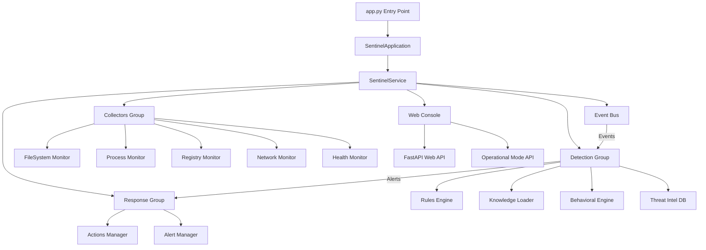
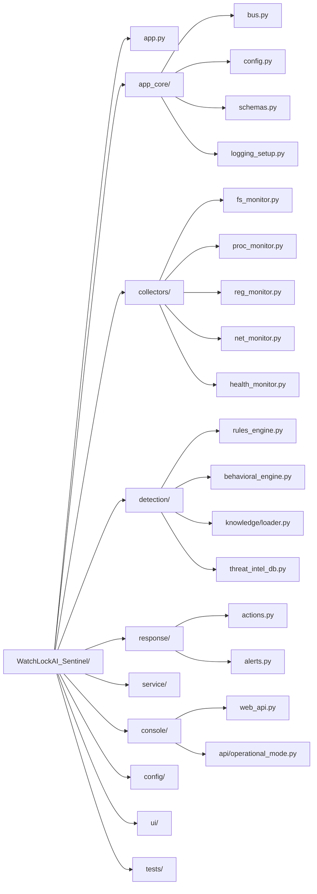

# WatchLockAI Sentinel - Workspace Overview

## Architecture Summary

WatchLockAI Sentinel is a Python-based endpoint security monitoring system designed for Windows environments with cross-platform compatibility. The system follows a modular, event-driven architecture centered around an asynchronous event bus that enables loose coupling between monitoring collectors and detection/response components.

### High-Level System Design

### Directory Structure

## Core Components

### Event Bus Architecture (`app_core/bus.py`)
- **Purpose**: Central async message passing system for component decoupling
- **Pattern**: Publisher-Subscriber with weak references to prevent memory leaks  
- **Features**: Event history, subscription filtering, concurrent event delivery
- **Key Classes**: `EventBus`, `EventSubscription`

### Configuration Management (`app_core/config.py`)
- **Purpose**: Centralized YAML-based configuration with Pydantic validation
- **Pattern**: Nested configuration classes with environment variable override
- **Key Classes**: `SentinelConfig`, `MonitoringConfig`, `OperationalConfig`
- **Storage**: `config.yaml` + `config/operational_mode.json` for runtime state

### Event Schema System (`app_core/schemas.py`)
- **Purpose**: Type-safe event models implementing consistent message contracts
- **Pattern**: Pydantic v2 models with validation and serialization
- **Event Types**: File, Process, Registry, Network, Health, Alert events
- **Validation**: Field constraints, enum validation, timestamp standardization

## Component Interactions

### Data Flow Pattern
1. **Collectors** → Generate typed events from system monitoring
2. **Event Bus** → Routes events to registered subscribers  
3. **Detection Engines** → Process events and generate alerts
4. **Response Actions** → Execute containment/remediation actions
5. **Web Console** → Provides management interface and operational control

### Cross-Platform Strategy
- **Windows-Specific**: Registry monitoring, Windows service integration
- **Linux Compatible**: Process/network/filesystem monitoring, web console
- **Platform Guards**: `sys.platform.startswith('win')` checks throughout codebase
- **Graceful Degradation**: Windows-only features become no-ops on Linux

## Integration Points

### External Dependencies
- **Windows Service**: `pywin32` for Windows service wrapper
- **Web Framework**: `FastAPI` + `uvicorn` for REST API and management console
- **System Monitoring**: `psutil` for cross-platform process/system metrics
- **File Monitoring**: `watchdog` library for filesystem event detection
- **Configuration**: `PyYAML` + `Pydantic` for structured configuration management

### Internal Service Boundaries
- **Operational Mode**: Persistent JSON-based state management in `config/operational_mode.py`
- **Knowledge System**: RAG-based threat intelligence with embedding/FTS search
- **Action Authorization**: Configurable destructive action controls based on operational mode
- **Event Persistence**: Optional JSONL logging for events and alerts

This architecture enables modular development, cross-platform deployment, and scalable monitoring capabilities while maintaining clear separation of concerns between system monitoring, threat detection, and incident response.